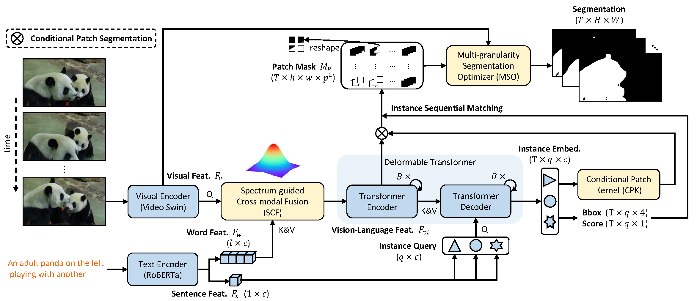

[](https://creativecommons.org/licenses/by-nc/4.0/)
[](https://arxiv.org/abs/2307.13537)

The official implementation of the **ICCV 2023** paper: 

<div align="center">
<h1>
<b>
Spectrum-guided Multi-granularity Referring Video Object Segmentation
</b>
</h1>
</div>

<p align="center"></p>

> [**Spectrum-guided Multi-granularity Referring Video Object Segmentation**](https://arxiv.org/abs/2307.13537)
>
> Bo Miao, Mohammed Bennamoun, Yongsheng Gao, Ajmal Mian
> 
> ICCV 2023

## Introduction

We propose a Spectrum-guided Multi-granularity (SgMg) approach that follows a <em>segment-and-optimize</em> pipeline to tackle the feature drift issue found in previous decode-and-segment approaches. Extensive experiments show that SgMg achieves state-of-the-art overall performance on multiple benchmark datasets, outperforming the closest competitor by 2.8% points on Ref-YouTube-VOS with faster inference time.

## Setup

The main setup of our code follows [Referformer](https://github.com/wjn922/ReferFormer).

Please refer to [install.md](docs/install.md) for installation.

Please refer to [data.md](docs/data.md) for data preparation.

## Training and Evaluation

All the models are trained using 2 RTX 3090 GPU. If you encounter the OOM error, please add the command `--use_checkpoint`.

The training and evaluation scripts are included in the `scripts` folder. If you want to train/evaluate SgMg, please run the following command:

```
sh dist_train_ytvos_videoswinb.sh
```

```
sh dist_test_ytvos_videoswinb.sh
```

Note: You can modify the `--backbone` and `--backbone_pretrained` to specify a backbone.

## Model Zoo

We provide the pretrained model for different [visual backbones](https://drive.google.com/drive/folders/13XFkNtYFIcTgEc3d7-8wQA-Ovi0T_z2v?usp=sharing) and the checkpoints for SgMg (refer below).

You can put the models in the `checkpoints` folder to start training/inference.

### Results (Ref-YouTube-VOS & Ref-DAVIS) 

To evaluate the results, please upload the zip file to the [competition server](https://codalab.lisn.upsaclay.fr/competitions/3282#participate).

| Backbone| Ref-YouTube-VOS J&F | Ref-DAVIS J&F | Model | Submission |
| :----: | :----: | :----: | :----: | :----: | 
| Video-Swin-T | 62.0 | 61.9 |[model](https://drive.google.com/file/d/1SiHl7oYqBabaN28nsrNOJeiZrJyhRixl/view?usp=sharing) | [link](https://drive.google.com/file/d/1jEVlgPzAuNJxOrcy83r0jbsGcRwPao3-/view?usp=sharing) | 
| Video-Swin-B | 65.7 | 63.3 | [model](https://drive.google.com/file/d/1sZngZ_7JlgZWX2bEQ7Xw36_VbBOlLJU8/view?usp=sharing) | [link](https://drive.google.com/file/d/1t5XqyqEsIvh0D92oSn-Pct4bfLsxcz73/view?usp=sharing) | 

### Results (A2D-Sentences & JHMDB-Sentences)

| Backbone | (A2D) mAP | Mean IoU | Overall IoU | (JHMDB) mAP | Mean IoU | Overall IoU | Model |
| :----: | :----: | :----: | :----: | :----: | :----: | :----: | :----: |
| Video-Swin-T | 56.1 | 78.0 | 70.4 | 44.4 | 72.8 | 71.7 | [model](https://drive.google.com/file/d/1LKjaMOBrpGT7tWLS3CmhDl_QQfUQPglJ/view?usp=sharing) |
| Video-Swin-B | 58.5 | 79.9 | 72.0 | 45.0 | 73.7 | 72.5 | [model](https://drive.google.com/file/d/1PQh0QSWqWUUnWf9WtvHgZ7plrORQvjzN/view?usp=sharing) |

### Results (RefCOCO/+/g)

The overall IoU is used as the metric, and the model is obtained from the pre-training stage mentioned in the paper.

| Backbone | RefCOCO | RefCOCO+ | RefCOCOg | Model |
| :----:   | :----:  | :----:   | :----:   | :----: |
| Video-Swin-B | 76.3 | 66.4 | 70.0 | [model](https://drive.google.com/file/d/1URnBMpZh0J7mBg6H2b1pdqywMM8vOopG/view?usp=sharing) |

## Acknowledgements

- [Deformable DETR](https://github.com/fundamentalvision/Deformable-DETR)
- [ReferFormer](https://github.com/wjn922/ReferFormer)
- [MTTR](https://github.com/mttr2021/MTTR)

## Citation

```
@article{miao2023SgMg,
      title={Spectrum-guided Multi-granularity Referring Video Object Segmentation}, 
      author={Miao, Bo and Bennamoun, Mohammed and Gao, Yongsheng and Mian, Ajmal},
      journal={arXiv preprint arXiv:2307.13537},
      year={2023},
}
```

## Contact
If you have any questions about this project, please feel free to contact bomiaobbb@gmail.com.
